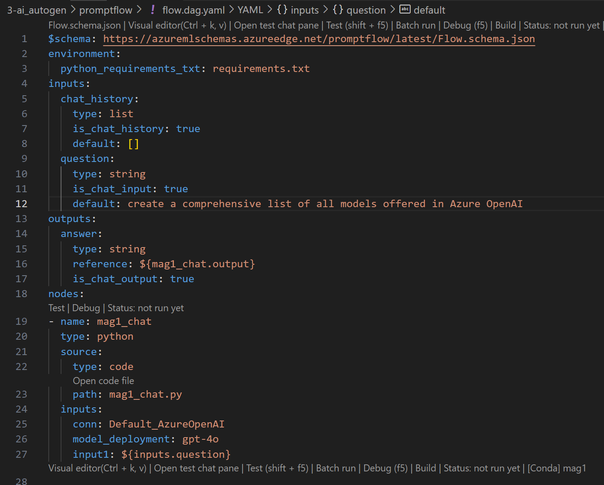

# Magentic-One

[Magentic-One](https://aka.ms/magentic-one-blog) is a generalist multi-agent system for solving open-ended web and file-based tasks across a variety of domains. It represents a significant step forward for multi-agent systems, achieving competitive performance on a number of agentic benchmarks (see the [technical report](https://arxiv.org/abs/2411.04468) for full details).

When originally released in [November 2024](https://aka.ms/magentic-one-blog) Magentic-One was [implemented directly on the `autogen-core` library](https://github.com/microsoft/autogen/tree/v0.4.4/python/packages/autogen-magentic-one). We have now ported Magentic-One to use `autogen-agentchat`, providing a more modular and easier to use interface.

To this end, the Magentic-One orchestrator {py:class}`~autogen_agentchat.teams.MagenticOneGroupChat` is now simply an AgentChat team, supporting all standard AgentChat agents and features. Likewise, Magentic-One's {py:class}`~autogen_ext.agents.web_surfer.MultimodalWebSurfer`, {py:class}`~autogen_ext.agents.file_surfer.FileSurfer`, and {py:class}`~autogen_ext.agents.magentic_one.MagenticOneCoderAgent` agents are now broadly available as AgentChat agents, to be used in any AgentChat workflows.

Lastly, there is a helper class, {py:class}`~autogen_ext.teams.magentic_one.MagenticOne`, which bundles all of this together as it was in the paper with minimal configuration.

Find additional information about Magentic-one in our [blog post](https://aka.ms/magentic-one-blog) and [technical report](https://arxiv.org/abs/2411.04468).


**Example**: The figure above illustrates Magentic-One multi-agent team completing a complex task from the GAIA benchmark. Magentic-One's Orchestrator agent creates a plan, delegates tasks to other agents, and tracks progress towards the goal, dynamically revising the plan as needed. The Orchestrator can delegate tasks to a FileSurfer agent to read and handle files, a WebSurfer agent to operate a web browser, or a Coder or Computer Terminal agent to write or execute code, respectively.

```{caution}
Using Magentic-One involves interacting with a digital world designed for humans, which carries inherent risks. To minimize these risks, consider the following precautions:

1. **Use Containers**: Run all tasks in docker containers to isolate the agents and prevent direct system attacks.
2. **Virtual Environment**: Use a virtual environment to run the agents and prevent them from accessing sensitive data.
3. **Monitor Logs**: Closely monitor logs during and after execution to detect and mitigate risky behavior.
4. **Human Oversight**: Run the examples with a human in the loop to supervise the agents and prevent unintended consequences.
5. **Limit Access**: Restrict the agents' access to the internet and other resources to prevent unauthorized actions.
6. **Safeguard Data**: Ensure that the agents do not have access to sensitive data or resources that could be compromised. Do not share sensitive information with the agents.
Be aware that agents may occasionally attempt risky actions, such as recruiting humans for help or accepting cookie agreements without human involvement. Always ensure agents are monitored and operate within a controlled environment to prevent unintended consequences. Moreover, be cautious that Magentic-One may be susceptible to prompt injection attacks from webpages.
```

## Getting started

Install the required packages:

```bash
pip install autogen-agentchat autogen-ext[magentic-one,openai]

# If using the MultimodalWebSurfer, you also need to install playwright dependencies:
playwright install --with-deps chromium
```

If you haven't done so already, go through the AgentChat tutorial to learn about the concepts of AgentChat.


## Architecture


Magentic-One work is based on a multi-agent architecture where a lead Orchestrator agent is responsible for high-level planning, directing other agents and tracking task progress. The Orchestrator begins by creating a plan to tackle the task, gathering needed facts and educated guesses in a Task Ledger that is maintained. At each step of its plan, the Orchestrator creates a Progress Ledger where it self-reflects on task progress and checks whether the task is completed. If the task is not yet completed, it assigns one of Magentic-One other agents a subtask to complete. After the assigned agent completes its subtask, the Orchestrator updates the Progress Ledger and continues in this way until the task is complete. If the Orchestrator finds that progress is not being made for enough steps, it can update the Task Ledger and create a new plan. This is illustrated in the figure above; the Orchestrator work is thus divided into an outer loop where it updates the Task Ledger and an inner loop to update the Progress Ledger.

Overall, Magentic-One consists of the following agents:

- Orchestrator: the lead agent responsible for task decomposition and planning, directing other agents in executing subtasks, tracking overall progress, and taking corrective actions as needed
- WebSurfer: This is an LLM-based agent that is proficient in commanding and managing the state of a Chromium-based web browser. With each incoming request, the WebSurfer performs an action on the browser then reports on the new state of the web page   The action space of the WebSurfer includes navigation (e.g. visiting a URL, performing a web search);  web page actions (e.g., clicking and typing); and reading actions (e.g., summarizing or answering questions). The WebSurfer relies on the accessibility tree of the browser and on set-of-marks prompting to perform its actions.
- FileSurfer: This is an LLM-based agent that commands a markdown-based file preview application to read local files of most types. The FileSurfer can also perform common navigation tasks such as listing the contents of directories and navigating a folder structure.
- Coder: This is an LLM-based agent specialized through its system prompt for writing code, analyzing information collected from the other agents, or creating new artifacts.
- ComputerTerminal: Finally, ComputerTerminal provides the team with access to a console shell where the Coder’s programs can be executed, and where new programming libraries can be installed.

Together, Magentic-One’s agents provide the Orchestrator with the tools and capabilities that it needs to solve a broad variety of open-ended problems, as well as the ability to autonomously adapt to, and act in, dynamic and ever-changing web and file-system environments.

While the default multimodal LLM we use for all agents is GPT-4o, Magentic-One is model agnostic and can incorporate heterogonous models to support different capabilities or meet different cost requirements when getting tasks done. For example, it can use different LLMs and SLMs and their specialized versions to power different agents. We recommend a strong reasoning model for the Orchestrator agent such as GPT-4o. In a different configuration of Magentic-One, we also experiment with using OpenAI o1-preview for the outer loop of the Orchestrator and for the Coder, while other agents continue to use GPT-4o.

## Run the promptflow:



- Modify the `default` text to your desired task.
- Use the "Test" feature, or `shift-f5`, the run the promptflow in Standard Mode.
  
### Example Output
#### answer:
```
Here is a comprehensive list of all models currently offered in Azure OpenAI Service based on the latest information available from Microsoft's official documentation:

1.  **GPT-4 Series**:

    *   **GPT-4**:
        *   gpt-4 Version 0314
        *   gpt-4 Version 0613
        *   gpt-4-32k Version 0613
    *   **GPT-4 Turbo**:
        *   gpt-4o (2024-11-20)
        *   gpt-4o mini (2024-07-18)
        *   gpt-4o (2024-08-06)
        *   gpt-4 Turbo with Vision (turbo-2024-04-09)
        *   gpt-4 Turbo Preview (0125-Preview, 1106-Preview, vision-preview)
2.  **GPT-3.5 Series**:

    *   **GPT-3.5**:
        *   gpt-35-turbo (0125) NEW
        *   gpt-35-turbo (1106)
        *   gpt-35-turbo-instruct (0914)
        *   gpt-35-turbo-16k (0613)
        *   gpt-35-turbo (0613)
        *   gpt-35-turbo (0301)
3.  **Embeddings Models**:

    *   text-embedding-3-large
    *   text-embedding-3-small
    *   text-embedding-ada-002
4.  **DALL-E Series**:

    *   **DALL-E 3** for image generation.
5.  **Whisper (Preview)**:

    *   Whisper models for speech to text.
6.  **Text to Speech (Preview)**:

    *   Text to speech models, currently in preview, to synthesize text to speech.
7.  **O-Series Models**:

    *   designed for tacklűng complex reasoning and problem-solving tasks.

This list includes the most recent and powerful models, with capabilities ranging from natural language understanding and generation to image generation and speech processing. The availability of models varies by region and deployment type as noted on Azure’s official documentation.

For detailed capabilities and deployment options, refer to [Azure OpenAI Service documentation](https://learn.microsoft.com/en-us/azure/ai-services/openai/concepts/models?tabs=global-standard%2Cstandard-chat-completions).

If you have any specific needs or require assistance in selecting the appropriate model for your use case, please feel free to ask!
```


## Citation

```

@misc{fourney2024magenticonegeneralistmultiagentsolving,
      title={Magentic-One: A Generalist Multi-Agent System for Solving Complex Tasks},
      author={Adam Fourney and Gagan Bansal and Hussein Mozannar and Cheng Tan and Eduardo Salinas and Erkang and Zhu and Friederike Niedtner and Grace Proebsting and Griffin Bassman and Jack Gerrits and Jacob Alber and Peter Chang and Ricky Loynd and Robert West and Victor Dibia and Ahmed Awadallah and Ece Kamar and Rafah Hosn and Saleema Amershi},
      year={2024},
      eprint={2411.04468},
      archivePrefix={arXiv},
      primaryClass={cs.AI},
      url={https://arxiv.org/abs/2411.04468},
}

```