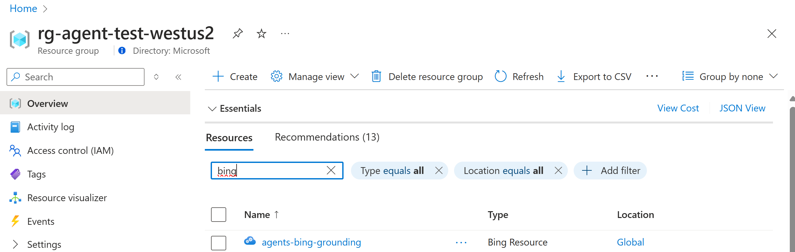
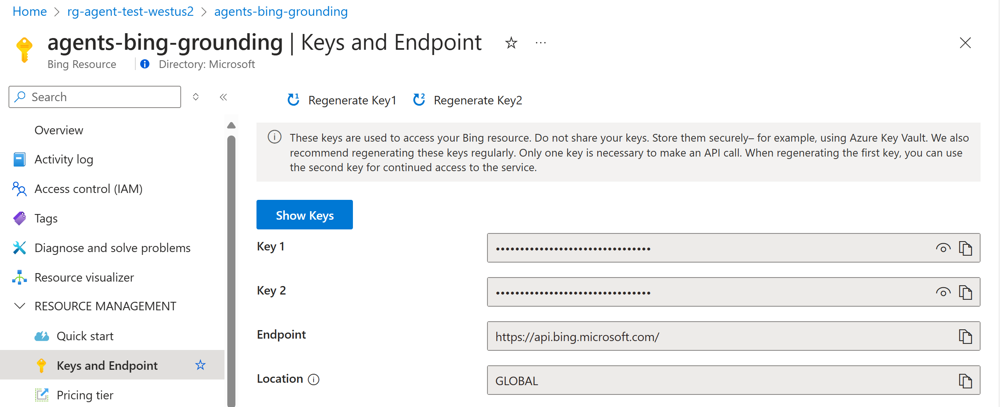
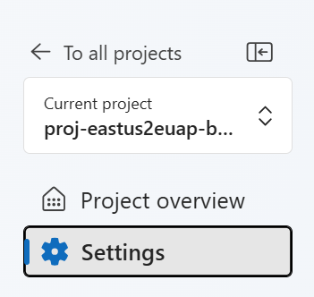
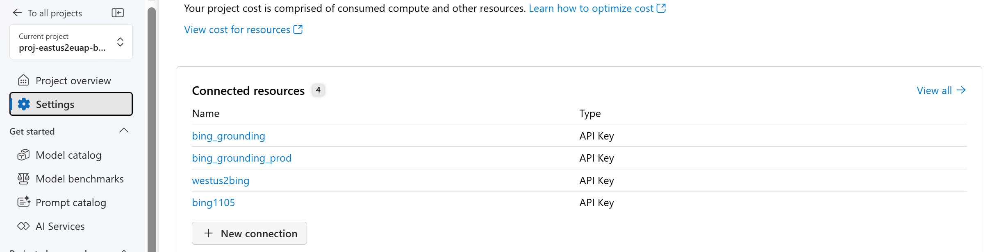
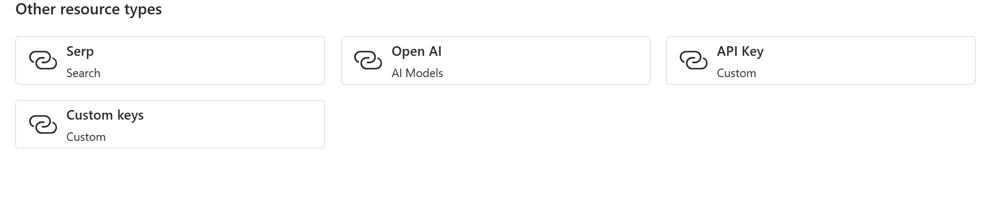
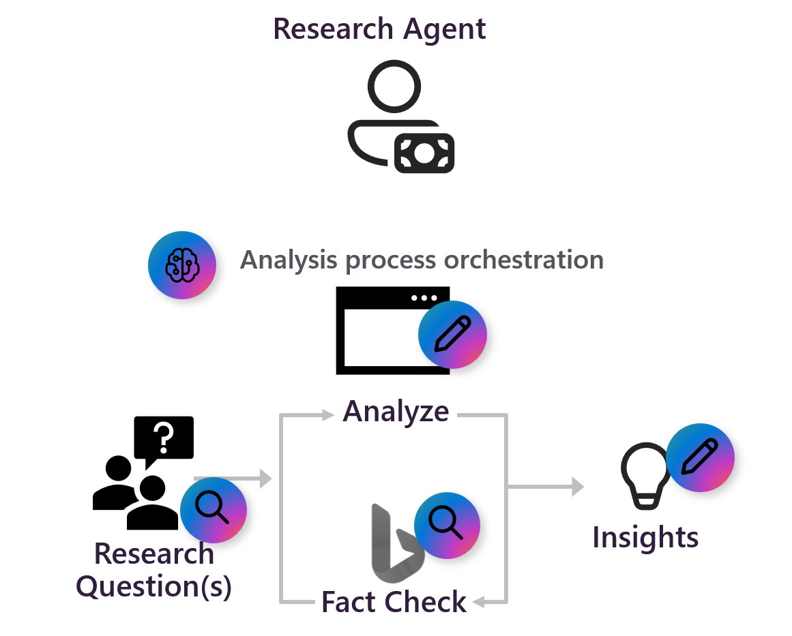
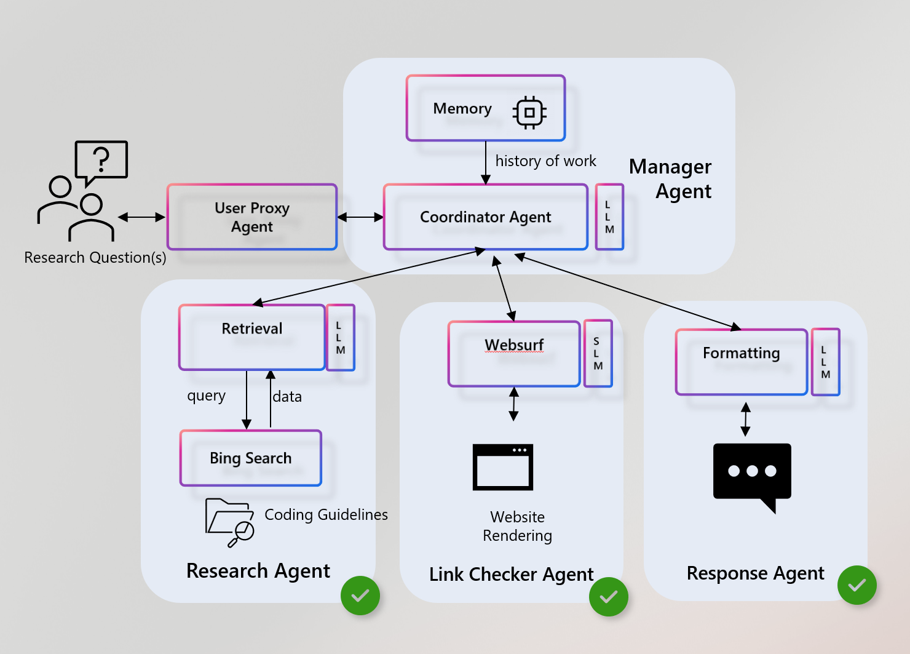
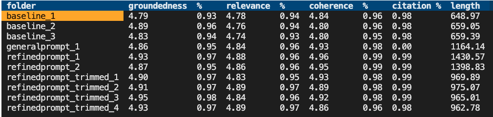
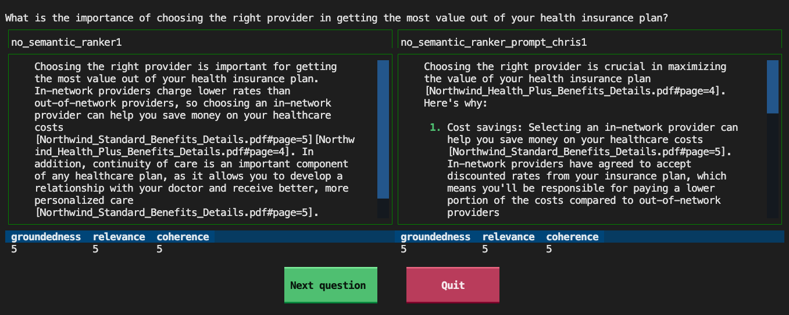

# Getting started with **Azure AI Agent Service**

This repo contains scripts and flows for deploying and creating AI Agents in both Single Agent and Multi Agent deployment types.

## Features

This demo teaches developers how to:

- **Create or Reuse Agents Programmatically**  
  Demonstrates how to connect to an Azure AI Foundry hub, either create a new agent with customized instructions (using GPT-4o or any supported model), or reuse an existing agent.

- **Incorporate Bing Grounding**  
  Shows how to add Bing search capabilities to an agent, including how to customize the search query and format the results.    

- **Integrate Server-Side Tools**  
  Illustrates adding tools—like Bing search, file search, and custom Python functions—into a single `ToolSet`, and how to intercept and log each tool call.

- **Evaluate Agent Performance**  
  Demonstrates how to evaluate the performance of an agent using a set of questions and answers, and how to visualize the results.

Table of contents:

* [Setting up this project](#setting-up-this-project)
* [Deploying Single Agent](#deploying-single-agent)
* [Deploying Multi Agent](#deploying-multi-agent)
* [Running an evaluation](#running-an-evaluation)
* [Viewing the results](#viewing-the-results)

## Setting up this project
### Prerequisites
- **Python 3.9+**  
- **Visual Studio Code** with the Python and Jupyter extensions  
- An **Azure AI Foundry** resource set up (see [Azure AI Agent Service docs](https://learn.microsoft.com/azure/ai-services/agents/))
- 
### Installation & Setup

1. **Clone** this repository:

   ```bash
   git clone https://github.com/jakeatmsft/fsi-ai-agent-hackathon.git
   ```

2. **Create a virtual environment** (using venv as an example):

    ```bash
    python -m venv .venv
    ```

3. **Activate** your virtual environment:

    - Windows: `.venv\Scripts\activate`
    - macOS/Linux: `source .venv/bin/activate`

4. **Install** the required dependencies:

    ```bash
    pip install -r requirements.txt
    ```

5. **Create a `.env` file** at the root of this folder to store secret keys and settings (e.g., the connection string and optional model name). You can copy the provided `.env.example` file:

    - Windows (PowerShell):
      ```powershell
      Copy-Item -Path .env.example -Destination .env
      ```
    
    - macOS/Linux:
      ```bash
      cp .env.example .env
      ```

    Then, open the `.env` file and update it with your configuration details.

    - Add your [Azure AI Foundry](https://learn.microsoft.com/azure/ai-services/agents/quickstart?pivots=programming-language-python-azure#configure-and-run-an-agent) connection string:
        ```plaintext
        PROJECT_CONNECTION_STRING="<HostName>;<AzureSubscriptionId>;<ResourceGroup>;<ProjectName>"
        ```

    - Specify the [compatible model](https://learn.microsoft.com/azure/ai-services/agents/how-to/tools/bing-grounding?tabs=python&pivots=overview#setup) you want to use (e.g. GPT-4o):
        ```plaintext
        MODEL_NAME="YOUR_MODEL_NAME"
        ```

    - **Grounding with Bing**
            
    ## Setup  
    
    > [!IMPORTANT]
    > 1. Grounding with Bing Search has a separate [Terms of Use agreement](https://www.microsoft.com/en-us/bing/apis/grounding-legal-preview) you need to agree to in order to move forward. Please [use this form](https://forms.office.com/r/2j3Sgu8S9K) to sign the agreement. After you have signed the form, it will take 1-3 days for us to whitelist your subscription.
    > 2. Please make sure your resource is created in `EastUS`.
    > 3. We recommend using the following models: `gpt-3.5-turbo-0125`, `gpt-4-0125-preview`, `gpt-4-turbo-preview`, `gpt-4-turbo`, `gpt-4-turbo-2024-04-09`, `gpt-4o`, `gpt-4o-mini`, `gpt-4o-mini-2024-07-18`
    
    
    1. Ensure you have logged in to Azure, using `az login`
    
    2. Register the Bing Search provider
       ```console
           az provider register --namespace 'Microsoft.Bing'
       ```
    
    3. Create a new Grounding with Bing Search resource using one of the methods below:
        - [Create Bing resource in Azure](https://ms.portal.azure.com/#create/Microsoft.BingGroundingSearch) 
        - AI Foundry Studio [AI Foundry Setup](https://learn.microsoft.com/en-us/azure/ai-services/agents/how-to/tools/bing-grounding?tabs=python&pivots=overview#setup)
  
    4. After you have created a Grounding with Bing Search resource, you can find it in [Azure Portal](https://ms.portal.azure.com/#home). Going to the resource group you have created the resource at, search for the Grounding with Bing Search resource you have created.
    
    5. Click the Grounding with Bing Search resource you have created and copy any of the API key
    
    6. Go to [Azure AI Studio](https://ai.azure.com/) and select the AI Project(make sure it's in the same resource group of your Grounding with Bing Search resource). Click Settings and then "+new connection" button in Settings page
    
    
    7. Select "API key" custom connection in other resource types
    
    8. Enter the following information and then create a new connection to your Grounding with Bing Search resource
    - Endpoint: https://api.bing.microsoft.com/
    - Key: YOUR_API_KEY
    - Connection name: YOUR_CONNECTION_NAME (You will use this connection name in the sample code below.)
    - Access: you can choose either "this project only" or "shared to all projects". Just make sure in the sample code below, the project you entered connection string for has access to this connection.


## Deploying Single Agent

Follow instructions in [1-single-agent](./1-ai_foundry_agent/README.md) to deploy a single agent.

## Deploying Multi Agent

Follow instructions in [2-ai_multiagent](./2-ai_multiagent/README.md) to deploy an agent team.


## Running an evaluation
We provide a script that loads in the current `azd` environment's variables, installs the requirements for the evaluation, and runs the evaluation against the local app. Run it like this:

```shell
python -m scripts evaluate --config=example_config.json
```

The config.json should contain these fields as a minimum:

```json
{
    "testdata_path": "example_input/qa.jsonl",
    "target_url": "http://localhost:50505/chat",
    "requested_metrics": ["groundedness", "relevance", "coherence", "latency", "answer_length"],
    "results_dir": "example_results/experiment<TIMESTAMP>"
}
```

### Running against a local container

If you're running this evaluator in a container and your app is running in a container on the same system, use a URL like this for the `target_url`:

"target_url": "http://host.docker.internal:50505/chat"

### Running against a deployed app

To run against a deployed endpoint, change the `target_url` to the chat endpoint of the deployed app:

"target_url": "https://app-backend-j25rgqsibtmlo.azurewebsites.net/chat"

### Running on a subset of questions

It's common to run the evaluation on a subset of the questions, to get a quick sense of how the changes are affecting the answers. To do this, use the `--numquestions` parameter:

```shell
python -m scripts evaluate --config=example_config.json --numquestions=2
```

### Specifying the evaluate metrics

The `evaluate` command will use the metrics specified in the `requested_metrics` field of the config JSON.
Some of those metrics are built-in to the evaluation SDK, and the rest are custom metrics that we've added.

#### Built-in metrics

These metrics are calculated by sending a call to the GPT model, asking it to provide a 1-5 rating, and storing that rating.

> [!IMPORTANT]
> The built-in metrics are only intended for use on evaluating English language answers, since they use English-language prompts internally. For non-English languages, you should use the [custom prompt metrics](#prompt-metrics) instead.

* [`gpt_coherence`](https://learn.microsoft.com/azure/ai-studio/concepts/evaluation-metrics-built-in#ai-assisted-coherence) measures how well the language model can produce output that flows smoothly, reads naturally, and resembles human-like language.
* [`gpt_relevance`](https://learn.microsoft.com/azure/ai-studio/concepts/evaluation-metrics-built-in#ai-assisted-relevance) assesses the ability of answers to capture the key points of the context.
* [`gpt_groundedness`](https://learn.microsoft.com/azure/ai-studio/concepts/evaluation-metrics-built-in#ai-assisted-groundedness) assesses the correspondence between claims in an AI-generated answer and the source context, making sure that these claims are substantiated by the context.
* [`gpt_similarity`](https://learn.microsoft.com/azure/ai-studio/concepts/evaluation-metrics-built-in#ai-assisted-gpt-similarity) measures the similarity between a source data (ground truth) sentence and the generated response by an AI model.
* [`gpt_fluency`](https://learn.microsoft.com/azure/ai-studio/concepts/evaluation-metrics-built-in#ai-assisted-fluency) measures the grammatical proficiency of a generative AI's predicted answer.
* [`f1_score`](https://learn.microsoft.com/azure/ai-studio/concepts/evaluation-metrics-built-in#traditional-machine-learning-f1-score) Measures the ratio of the number of shared words between the model generation and the ground truth answers.

#### Custom metrics

##### Prompt metrics

The following metrics are implemented very similar to the built-in metrics, but use a locally stored prompt. They're a great fit if you find that the built-in metrics are not working well for you or if you need to translate the prompt to another language.

* `mycoherence`: Measures how well the language model can produce output that flows smoothly, reads naturally, and resembles human-like language. Based on `scripts/evaluate_metrics/prompts/coherence.prompty`.
* `myrelevance`: Assesses the ability of answers to capture the key points of the context. Based on `scripts/evaluate_metrics/prompts/relevance.prompty`.
* `mygroundedness`: Assesses the correspondence between claims in an AI-generated answer and the source context, making sure that these claims are substantiated by the context. Based on `scripts/evaluate_metrics/prompts/groundedness.prompty`.

##### Code metrics

These metrics are calculated with some local code based on the results of the chat app, and do not require a call to the GPT model.

* `latency`: The time it takes for the chat app to generate an answer, in seconds.
* `length`: The length of the generated answer, in characters.
* `has_citation`: Whether the answer contains a correctly formatted citation to a source document, assuming citations are in square brackets.
* `citation_match`: Whether the answer contains at least all of the citations that were in the ground truth answer.

### Sending additional parameters to the app

This repo assumes that your chat app is following the [AI Chat Protocol](https://github.com/microsoft/ai-chat-protocol/tree/main/spec#readme), which means that all POST requests look like this:

```json
{"messages": [{"content": "<Actual user question goes here>", "role": "user"}],
 "context": {...},
}
```

Any additional app parameters would be specified in the `context` of that JSON, such as temperature, search settings, prompt overrides, etc. To specify those parameters, add a `target_parameters` key to your config JSON. For example:

```json
    "target_parameters": {
        "overrides": {
            "semantic_ranker": false,
            "prompt_template": "<READFILE>example_input/prompt_refined.txt"
        }
    }
```

The `overrides` key is the same as the `overrides` key in the `context` of the POST request.
As a convenience, you can use the `<READFILE>` prefix to read in a file and use its contents as the value for the parameter.
That way, you can store potential (long) prompts separately from the config JSON file.

### Specifying the location of answer and context in response

The evaluator needs to know where to find the answer and context in the response from the chat app.
If your app returns responses following the recommendations of the [AI Chat Protocol](https://github.com/microsoft/ai-chat-protocol/tree/main/spec#readme), then the answer will be "message": "content" and the context will be a list of strings in "context": "data_points": "text".

If your app returns responses in a different format, you can specify the [JMESPath expressions](https://jmespath.org/) to extract the answer and context from the response. For example:

```json
    "target_response_answer_jmespath": "message.content",
    "target_response_context_jmespath": "context.data_points.text"
```

## Viewing the results

The results of each evaluation are stored in a results folder (defaulting to `example_results`).
Inside each run's folder, you'll find:

* `eval_results.jsonl`: Each question and answer, along with the GPT metrics for each QA pair.
* `parameters.json`: The parameters used for the run, like the overrides.
* `summary.json`: The overall results, like the average GPT metrics.
* `config.json`: The original config used for the run. This is useful for reproducing the run.

To make it easier to view and compare results across runs, we've built a few tools,
located inside the `review-tools` folder.

### Using the summary tool

To view a summary across all the runs, use the `summary` command with the path to the results folder:

```bash
python -m review_tools summary example_results
```

This will display an interactive table with the results for each run, like this:



To see the parameters used for a particular run, select the folder name.
A modal will appear with the parameters, including any prompt override.

### Using the compare tool

To compare the answers generated for each question across 2 runs, use the `compare` command with 2 paths:

```bash
python -m review_tools diff example_results/baseline_1 example_results/baseline_2
```

This will display each question, one at a time, with the two generated answers in scrollable panes,
and the GPT metrics below each answer.

]

Use the buttons at the bottom to navigate to the next question or quit the tool.

You can also filter to only show questions where the value changed for a particular metric, like this:

```bash
python -m review_tools diff example_results/baseline_1 example_results/baseline_2 --changed=has_citation
```

## Measuring app's ability to say "I don't know"

The evaluation flow described above focused on evaluating a model’s answers for a set of questions that *could* be answered by the data. But what about all those questions that can’t be answered by the data? Does your model know how to say “I don’t know?” The GPT models are trained to try and be helpful, so their tendency is to always give some sort of answer, especially for answers that were in their training data. If you want to ensure your app can say “I don’t know” when it should, you need to evaluate it on a different set of questions with a different metric.

### Generating ground truth data for answer-less questions

For this evaluation, our ground truth data needs to be a set of question whose answer should provoke an "I don’t know" response from the data. There are several categories of such questions:

* **Unknowable**: Questions that are related to the sources but not actually in them (and not public knowledge).
* **Uncitable**: Questions whose answers are well known to the LLM from its training data, but are not in the sources. There are two flavors of these:
  * **Related**: Similar topics to sources, so LLM will be particularly tempted to think the sources know.
  * **Unrelated**: Completely unrelated to sources, so LLM shouldn’t be as tempted to think the sources know.
* **Nonsensical**: Questions that are non-questions, that a human would scratch their head at and ask for clarification.

You can write these questions manually, but it’s also possible to generate them using a generator script in this repo,
assuming you already have ground truth data with answerable questions.

```shell
python -m scripts generate-dontknows --input=example_input/qa.jsonl --output=example_input/qa_dontknows.jsonl --numquestions=45
```

That script sends the current questions to the configured GPT-4 model along with prompts to generate questions of each kind.

When it’s done, you should review and curate the resulting ground truth data. Pay special attention to the "unknowable" questions at the top of the file, since you may decide that some of those are actually knowable, and you may want to reword or rewrite entirely.

### Running an evaluation for answer-less questions

This repo contains a custom GPT metric called "dontknowness" that rates answers from 1-5, where 1 is "answered the question completely with no certainty" and 5 is "said it didn't know and attempted no answer". The goal is for all answers to be rated 4 or 5.

Here's an example configuration JSON that requests that metric, referencing the new ground truth data and a new output folder:

```json
{
    "testdata_path": "example_input/qa_dontknows.jsonl",
    "results_dir": "example_results_dontknows/baseline",
    "requested_metrics": ["dontknowness", "answer_length", "latency", "has_citation"],
    "target_url": "http://localhost:50505/chat",
    "target_parameters": {
    },
    "target_response_answer_jmespath": "message.content",
    "target_response_context_jmespath": "context.data_points.text"
}
```

We recommend a separate output folder, as you'll likely want to make multiple runs and easily compare between those runs using the [review tools](#viewing-the-results).

Run the evaluation like this:

```shell
python -m scripts evaluate --config=dontknows.config.json
```

The results will be stored in the `results_dir` folder, and can be reviewed using the [review tools](#viewing-the-results).

### Improving the app's ability to say "I don't know"

If the app is not saying "I don't know" enough, you can use the `diff` tool to compare the answers for the "dontknows" questions across runs, and see if the answers are improving. Changes you can try:

* Adjust the prompt to encourage the model to say "I don't know" more often. Remove anything in the prompt that might be distracting or overly encouraging it to answer.
* Try using GPT-4 instead of GPT-3.5. The results will be slower (see the latency column) but it may be more likely to say "I don't know" when it should.
* Adjust the temperature of the model used by your app.
* Add an additional LLM step in your app after generating the answer, to have the LLM rate its own confidence that the answer is found in the sources. If the confidence is low, the app should say "I don't know".
